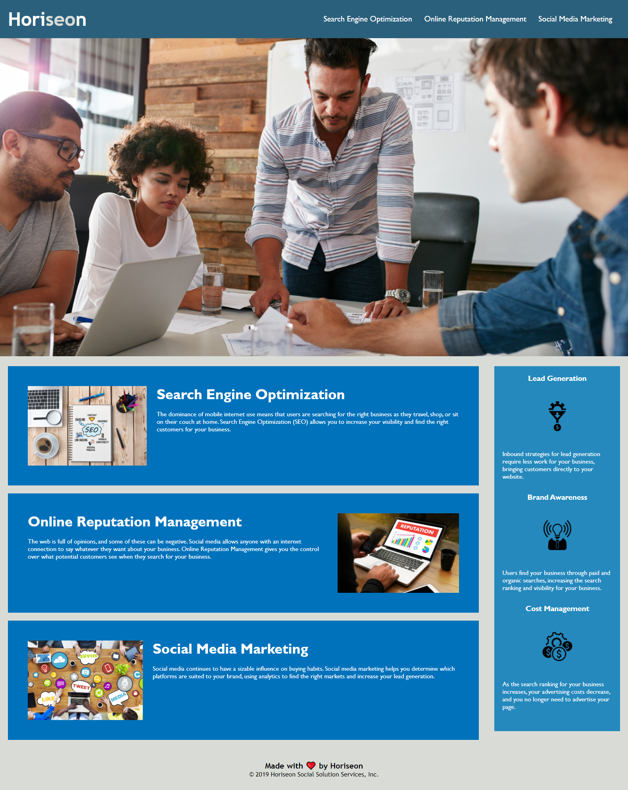

## Description

This website is made for Horiseon Social Solution Services. 
They are a company that offers Search Engine Optimization, Online Reputiation Management, and Social Media Markting.

## Deployed Website URL
https://mli2950.github.io/Homework1/

## Solutions
1. The first problem I came across was that the "Search Engine Optimization" link did not take you to the proper place. I fixed this by adding creating the proper ID for the link, and ensuring it was linked.

2. The second problem is that the HTML code used all DIV tags, and no comments. It was just generally unorganized. I changed all the DIV tags to semantics, and added comments between each major section.

3. The third problem was that none of the images had alt attributes. I played with this, and realized that alt did not work with my google chrome, So I instead opted to use title. This solved the problem.

4. The fourth and final issue was that the CSS had several classes that could have been condensed into smaller classes. I did this, and commented in the CSS so that you would know where I made the changes.

